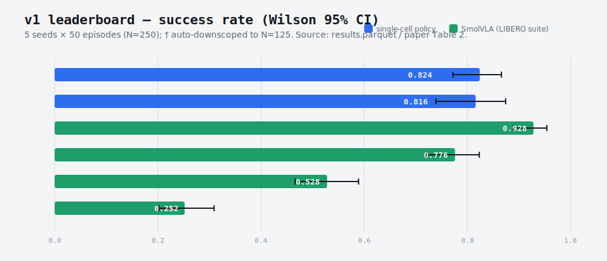
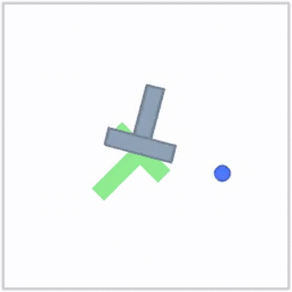
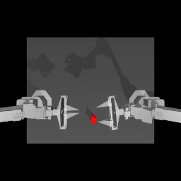
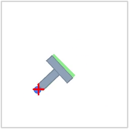
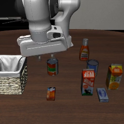
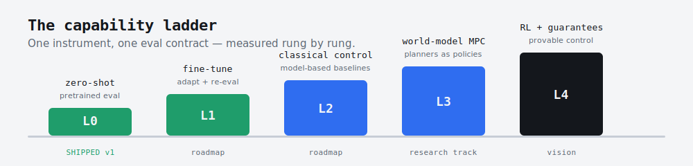

<div align="center">


### One measurement contract for embodied-AI policies, from pretrained models to world-model planners.

A public, reproducible **instrument** that scores every robot-policy paradigm — pretrained imitation, fine-tuning, classical control, world-model planning — as the *same* `obs → action` callable, on shared LeRobot tasks, with Wilson + bootstrap CIs, minimum-detectable-effect bounds, paired comparisons, and a hand-labeled failure taxonomy. Credibility comes from what it caught in its own harness: a normalization bug that pinned ACT × aloha at **0.016**, below the random floor; a clean 2×2 ablation attributes the full **0.016 → 0.824** recovery to the fix. An instrument that audits the auditor.

[](https://www.python.org/downloads/release/python-3120/)
[](LICENSE)
[](https://github.com/astral-sh/ruff)
[](https://github.com/thrmnn/embodimetry/actions/workflows/ci.yml)


**Quick links:** [Get started](docs/GETTING_STARTED.md) · [Reproduce](docs/REPRODUCE.md) · [Paper (LaTeX)](paper/main.tex) · [Bring your own env](docs/ENV_CONTRIBUTION_GUIDE.md) · [Contributing](CONTRIBUTING.md)

</div>

---

<div align="center">

|  ACT × aloha  |  replication |  coverage  |  rigor  |
|:---:|:---:|:---:|:---:|
| **0.824** [0.772, 0.866] | **18** published cells | **6** sim envs × **5** policies | **5 seeds × 50 ep** · Wilson + bootstrap CI |

</div>

<div align="center">

<picture>
  
</picture>

</div>

---

## ▶ Try it / See it

**Run a real eval cell live — no GPU, no login, ~2 min.** The notebook evaluates the two weights-free floors (`no_op` + `random`) on PushT in your own runtime and prints a real success rate with a Wilson 95% CI — the same `run_cell_from_specs` + `wilson_ci` API the leaderboard uses.

[](https://colab.research.google.com/github/thrmnn/embodimetry/blob/main/notebooks/try_embodimetry.ipynb) &nbsp; [**`notebooks/try_embodimetry.ipynb`**](notebooks/try_embodimetry.ipynb) &nbsp;·&nbsp; zero-GPU read: [`examples/read_results.py`](examples/read_results.py) &nbsp;·&nbsp; 🤗 hosted Space _(deploying — see [Live demo](#live-demo))_

**See it.** Real rollouts from v1 — a success and a failure, scored under one contract:

<div align="center">

| Diffusion × pusht ✓ | ACT × aloha ✓ | ACT × aloha ✗ |
|:---:|:---:|:---:|
|  |  |  |
| block pushed into the goal | cube transferred between arms | grasp slips — no transfer |

</div>

---

> **What it is.** Embodimetry measures embodied-AI policies under one auditable eval contract. Every number is a binary-outcome estimate with a confidence interval, anchored to a pinned `lerobot` release and per-policy checkpoint SHAs, and reproducible from a seed triple. v1's public leaderboard measures pretrained policies zero-shot (L0); the same contract already carries up the [capability ladder](#capability-ladder) — fine-tuning, classical control, and a *gated, in-flight* world-model-planning rung — so a controller and a transformer are scored on the same ruler. The lead is not a leaderboard ranking; it is the self-caught normalization bug (0.016 → 0.824) that demonstrates the instrument bites on the surface it exists to protect.

**Status: v1 finalized** (dataset version `v1.0.0`, with the v1.0.1 methodology audit folded into framing). Sweep complete — **22 cells (18 published) × 5 seeds = 110 cell-seed runs dispatched, 0 failures** across 6 policies × 6 envs (a cell is one `(policy, env)` pair). The pi0 family and `xvla_libero` are deferred to v1.1 (see [v1 scope](#v1-scope)).

---

## What you get

Three artifacts, all open:

1. **Public leaderboard** — Hugging Face Space + Hub dataset `thrmnn/embodimetry-v1` (v1.0.0, 110 cell-seed runs, 0 failures; 18 published cells). Every per-episode outcome and every rollout MP4, queryable by `(policy, env, seed, episode)`. _Space is **deploying** — see [Live demo](#live-demo)._
2. **4-page arxiv writeup** — [`paper/main.tex`](paper/main.tex). Methodology, related work, results, limitations. Every figure regenerated from [`notebooks/01-write-finding.ipynb`](notebooks/01-write-finding.ipynb).
3. **Upstream-ready eval pipeline** — [`src/embodimetry/eval.py`](src/embodimetry/eval.py), extractable as `lerobot.eval.multi_seed` for a follow-up PR to [`huggingface/lerobot`](https://github.com/huggingface/lerobot).

Two tools for running and inspecting it:

| | What | URL when local |
|---|---|---|
| 🟢 **`dashboard/`** | Local operator dashboard: live sweep progress, calibration inspector, rollout video preview, color-coded log tail | `make dashboard` → http://127.0.0.1:7860 |
| 🔵 **`space/`** | Public HF Space leaderboard, paired comparisons, failure taxonomy | `python space/app.py` |

---

## Live demo

The public leaderboard ships as a Hugging Face Space (Gradio): leaderboard, paired comparisons, rollout browser, failure taxonomy.

> **Status: deploying with v1.0.0.** The Space goes live alongside the Hub dataset upload — the badge above flips from `deploying` to a live link at that point. To run it locally right now: `python space/app.py`.

While the hosted Space is coming up, here is the v1 evidence the leaderboard is built from — real rollouts, one frame each (animated [loops](docs/assets/rollouts/loops/) are in the repo):

<div align="center">

| ACT × aloha ✓ | Diffusion × pusht ✓ | SmolVLA × libero_goal ✓ | SmolVLA × libero_10 ✗ |
|:---:|:---:|:---:|:---:|
|  |  |  |  |
| [loop](docs/assets/rollouts/loops/aloha-success.mp4) | [loop](docs/assets/rollouts/loops/dp-pusht.mp4) | [loop](docs/assets/rollouts/loops/libero-goal-success.mp4) | [loop](docs/assets/rollouts/loops/smolvla-10-fail.mp4) |

</div>

---

## v1 leaderboard

Pooled per-policy and the per-cell breakdown, success rate with **Wilson 95% CI**. Source: `results.parquet` / [paper](paper/main.tex) Table 2.

| Policy | env | N | success | 95% CI |
|---|---|:-:|:-:|:-:|
| **ACT** | aloha_transfer_cube | 250 | **0.824** | [0.772, 0.866] |
| **Diffusion Policy** | pusht | 125† | **0.816** | [0.739, 0.874] |
| **SmolVLA** | libero_goal | 250 | **0.928** | [0.889, 0.954] |
| **SmolVLA** | libero_spatial | 250 | 0.776 | [0.720, 0.823] |
| **SmolVLA** | libero_object | 250 | 0.528 | [0.466, 0.589] |
| **SmolVLA** | libero_10 | 250 | 0.252 | [0.202, 0.309] |

<sub>† `diffusion_policy × pusht` auto-downscoped to N=125 (25 ep/seed) after calibration flagged slow inference. `no_op` and `random` baselines run on every env as the floor; see the full matrix in [v1 scope](#v1-scope).</sub>

Two findings the leaderboard surfaces — both are **reproducibility proof-points, not the thesis**:

- **The ACT × aloha number is honest about a bench-side bug we caught.** The v1.0.0 release briefly read `0.016`; that was a **normalization bug on our end** — our harness silently skipped dataset normalization on `observation.images.top`, feeding ACT un-normalized images. Fixed in [PR #51](https://github.com/thrmnn/embodimetry/pull/51), the same checkpoint reads **0.824**. A 2×2 ablation shows the recovery is 100% the normalization fix and temporal ensembling is a wash. Full write-up: [§ methodology caveats](#methodology-caveats-v101-audit).
- **SmolVLA × libero_10 = 0.252 is a single-task probe, not the paper's 10-task average.** Real for that scope, a lower bound at our step cap; v1.1 closes both caveats. See [§ methodology caveats](#methodology-caveats-v101-audit).

---

## Capability ladder

v1 is the bottom rung. The point of building an *instrument* rather than a one-off benchmark is that the same eval contract — `act(obs) -> action`, scored with the same statistics — carries all the way up:

<div align="center">



</div>

The rungs below the in-flight one are **measured and honest about their negatives** — that is the spine that earns the instrument its credibility:

- **L0 — pretrained, zero-shot** _(shipped, v1 leaderboard)_: Diffusion Policy × PushT **0.816** [0.739, 0.874]; ACT × aloha **0.824** [0.772, 0.866]; the four SmolVLA × LIBERO cells (0.252–0.928). Strong rungs, no task-specific tuning.
- **L1 — fine-tune** _(measured, off-leaderboard)_: continuing to fine-tune the already-converged ACT moves 0.824 → 0.864, a **+0.040 shift whose CIs overlap** (Cohen's _h_ = 0.11, below the N=250 MDE) — reported as within noise, not an improvement. An attempted SmolVLA LoRA fine-tune **collapses, 0.252 → ~0** (a gripper-sign data-wiring bug the closed-loop number caught while every offline metric smiled; the 0.252 baseline is single-task and step-cap-truncated, so the collapse is real within that scope).
- **L2 — classical control** _(measured, off-leaderboard)_: a competent scripted PushT controller reaches ~0.50 mean coverage but clears the strict success bar only **0.012** [0.004, 0.035] of the time — learning buys the last fraction of precision a hand-tuned controller cannot.
- **L3 — world-model MPC** _(in-flight hypothesis, gated off the leaderboard)_: a *hypothesis*, not a result. We are probing a **dynamics-complexity gradient** — when a zero-training latent planner (DINO-WM CEM) can substitute for learning. PushT (contact-rich) is the endpoint where it does **not** (~0). The supporting Wall-navigation cell is an existence-proof (9/24 = 0.375, Wilson [0.21, 0.57] — spans chance), and the Wall-vs-PushT contrast is **confounded** (env, checkpoint, and CEM budget co-vary). It is framed as a gradient to be measured de-confounded, in a [separate research repo](docs/WM_RESEARCH_TRACK.md), and never quoted as a finding.
- **L4 — RL + guarantees** _(vision)_: the bridge from learning to provable control.

The world-model track runs in its own [research repo](https://github.com/thrmnn/lerobot-wm-research) and does **not** touch the production leaderboard; the only write-path is a gated adapter PR, held off the board until a planner is explicitly promoted. The two-speed operating model is documented in [`docs/TWO_SPEED.md`](docs/TWO_SPEED.md), the full ladder write-up in [`docs/blog/capability-ladder-audit.md`](docs/blog/capability-ladder-audit.md).

---

## Quickstart

**60 seconds, no GPU, no download.** A fresh clone ships a tiny committed view of the leaderboard headline cells. Read a real number with a confidence interval before installing anything heavy:

```bash
git clone https://github.com/thrmnn/embodimetry.git && cd embodimetry
pip install -e .                       # core deps (pandas + scipy); the sim/viz extras are NOT needed to read
python examples/read_results.py        # prints the v1 leaderboard table with Wilson 95% CIs
```

That reads `examples/results-mini.parquet` (regenerated deterministically by `scripts/make_results_mini.py` from the published numbers) and prints `act × aloha 0.824 [0.772, 0.866]`, the four SmolVLA × LIBERO cells, and `diffusion × pusht` — each with its confidence interval. No GPU, no Hub download, no full parquet.

**Then, reproduce a number on a GPU.** From `git clone` to a real benchmark result in two commands. Run them from an activated Python 3.12 conda env (`conda activate lerobot`):

```bash
# 1. Clone and install (editable, all extras: sim + viz + space + dev)
git clone https://github.com/thrmnn/embodimetry.git && cd embodimetry
pip install -e ".[all]"

# 2. Run a single (policy, env, seed) cell — a few minutes (model download + 5 rollouts)
python scripts/run_one.py --policy act --env aloha_transfer_cube --seed 0 --n-episodes 5
```

You just produced per-episode rows in `results/results.parquet` and rollout MP4s in `results/videos/` — the same artifacts every leaderboard number is built from. (No GPU? `run_one.py` detects it and points you back at the zero-GPU read above instead of crashing mid-rollout.)

**→ Full walkthrough, expected output, and common-issue fixes: [`docs/GETTING_STARTED.md`](docs/GETTING_STARTED.md).**

<details>
<summary><b>Run the full sweep</b></summary>

```bash
# 1. Calibrate (~30 min — measures step latency + VRAM per cell)
make calibrate

# 2. Merge per-policy calibration JSONs (if you split the run)
python scripts/merge_calibration.py results/calibration-cheap.json \
    results/calibration-smolvla.json results/calibration-xvla.json \
    --out results/calibration-$(date +%Y-%m-%d).json

# 3. Generate sweep_full.yaml overrides from calibration
python scripts/auto_downscope.py results/calibration-$(date +%Y-%m-%d).json --apply

# 4. Launch under the 18 GB cgroup cap (overnight, ~8-15 hr)
scripts/launch_overnight_sweep.sh

# Watch progress
make dashboard   # → http://127.0.0.1:7860
```

</details>

---

## v1 scope

**5 leaderboard policies + xvla executed-but-deferred × 6 envs — 22 cells (18 published) × 5 seeds = 110 cell-seed runs dispatched after `env_compat` filter, 0 failures:**

| | pusht | aloha_transfer_cube | libero_spatial | libero_object | libero_goal | libero_10 |
|---|:-:|:-:|:-:|:-:|:-:|:-:|
| `no_op` | ✓ | ✓ | ✓ | ✓ | ✓ | ✓ |
| `random` | ✓ | ✓ | ✓ | ✓ | ✓ | ✓ |
| `diffusion_policy` | ✓ | | | | | |
| `act` | | ✓ | | | | |
| `smolvla_libero` | | | ✓ | ✓ | ✓ | ✓ |
| `xvla_libero` | | | 🅓 | 🅓 | 🅓 | 🅓 |

Legend: ✓ runnable cell in v1 leaderboard · 🅓 cell *executed* in the v1 sweep but **deferred from the leaderboard**; upstream Hub artifacts ship with wiring bugs (PR #71 + PR #74 patch two; a third manifestation remained unresolved in the v1 window). See [`docs/DEFERRED_POLICIES.md`](docs/DEFERRED_POLICIES.md).

**5 seeds × 50 episodes per cell** (N=250 binary outcomes per cell; two cells — `diffusion_policy × pusht` (published) and `xvla × libero_10` (excluded from publish, dispatch-time downscope only) — were auto-downscoped to **25 episodes/seed (N=125)** after calibration flagged slow inference). The Pi0 family (`pi0_libero`, `pi0fast_libero`, `pi05_libero_finetuned_v044`) is **deferred to v1.1** — they overflow the 32 GB WSL2 host budget during `from_pretrained` cold load (~30 GB CPU RAM peak under HF Transformers' default weight-conversion path); v1.1 paths are quantized weights or `accelerate device_map="auto"` streaming load. The `xvla_libero` deferral is documented alongside the pi-family in [`docs/DEFERRED_POLICIES.md`](docs/DEFERRED_POLICIES.md).

---

## Methodology caveats (v1.0.1 audit)

After v1.0 sweep completion we conducted a static methodology audit against each policy's source paper and each env's canonical protocol. Three mismatches were confirmed; all three **constrain what the headline cells mean** without invalidating the underlying measurements. Every v1 parquet row remains valid for the scope it was measured under — the audit reframes how cross-paper comparisons should be read.

| Audit | What we ran | What the paper / canonical protocol uses | Effect on the headline |
|---|---|---|---|
| [PR #84](https://github.com/thrmnn/embodimetry/pull/84) — SmolVLA task coverage | `task_id=0` × 5 seeds × 50 ep = 250 single-task episodes per LIBERO suite | 10 tasks × 10 trials per task = 100-ep suite averages (Shukor et al., Table 2) | The "0.71 → 0.252" gap on `libero_10` is **single-task vs. 10-task-averaged scope**, not an apples-to-apples replication gap. Holds as a single-task envelope claim only. |
| [PR #86](https://github.com/thrmnn/embodimetry/pull/86) — ACT × aloha 0.016 | v1.0.0 harness silently skipped normalization on `observation.images.top` (un-normalized image obs) | Dataset normalization stats applied to all observation features | **RESOLVED — bench-side normalization bug on our end, fixed in [PR #51](https://github.com/thrmnn/embodimetry/pull/51).** Canonical ACT × aloha = **0.824** [0.772, 0.866] (N=250, Hub-default, norm fixed). A 2×2 ablation (norm {buggy, fixed} × inference {Hub-default, paper}, N=250/cell) — buggy=0.016/0.016, fixed=0.812/0.768 — shows recovery is 100% the norm fix and **temporal ensembling is a wash** (fixed cells indistinguishable). Probe: [`scripts/probes/probe_act_normalization_ablation.py`](scripts/probes/probe_act_normalization_ablation.py), [`results/probes/act-norm-ablation/`](results/probes/act-norm-ablation/). See [`docs/PROBE_RESULTS_V1.0.1.md`](docs/PROBE_RESULTS_V1.0.1.md). |
| [PR #89](https://github.com/thrmnn/embodimetry/pull/89) — LIBERO step caps | `max_steps={spatial=280, object=280, goal=300, libero_10=520}` (lerobot defaults) | `max_steps=600` for all four suites (canonical LIBERO, Liu et al.) | 74.8% of failed `libero_10` episodes hit our cap → **all four LIBERO numbers are lower bounds at our caps**; `libero_10` is the most sensitive. |

The 2×2 ACT normalization ablation, in full:

| | Hub-default inference | paper-settings inference |
|---|:-:|:-:|
| **buggy** norm | 0.016 | 0.016 |
| **fixed** norm | 0.812 | 0.768 |

On broken norm, switching to paper inference settings does **nothing** (0.016 → 0.016). On fixed norm, Hub-default vs paper settings are **statistically indistinguishable** (0.812 vs 0.768, overlapping Wilson CIs) — temporal ensembling is a wash, not the cause. The ablation's fixed+Hub cell (0.812) and the leaderboard 0.824 are separate N=250 runs of the same condition, consistent within CI.

[PR #90](https://github.com/thrmnn/embodimetry/pull/90) ships a selectable `--canonical` criterion on `scripts/run_one.py` and `scripts/run_sweep.py` that adopts the canonical step caps and paper-canonical success rules for PushT and Aloha; v1.1 reruns the audit-affected cells under it. Full audit reports: [`docs/CLAIM_AUDIT_SMOLVLA.md`](docs/CLAIM_AUDIT_SMOLVLA.md), [`docs/INFERENCE_AUDIT.md`](docs/INFERENCE_AUDIT.md), [`docs/SUCCESS_CRITERION_AUDIT.md`](docs/SUCCESS_CRITERION_AUDIT.md), [`docs/CANONICAL_CRITERIA.md`](docs/CANONICAL_CRITERIA.md). Per-policy "paper vs. measured" notes are in [`docs/MODEL_CARDS.md`](docs/MODEL_CARDS.md).

### Replication scatter

How each published cell compares to its source-paper number, with 95% CIs:

<div align="center">

<picture>
  
</picture>

</div>

---

## Methodology in 60 seconds

- **Seed contract.** Per-cell determinism via `(env_seed, action_seed, policy_seed)` triple derived from the cell's seed index. Re-running cell `(policy, env, seed=k)` reproduces the exact parquet rows.
- **Confidence intervals.** Wilson 95% on per-cell success rate; stratified bootstrap (10k resamples over seed × episode) for distributional summaries and paired deltas.
- **Minimum detectable effect (MDE).** Pre-computed per-cell from N=250 and the cell's empirical success rate. Headline findings cite deltas only where `|delta| > MDE` (see [`docs/MDE_TABLE.md`](docs/MDE_TABLE.md)).
- **Failure taxonomy.** Per-rollout categorical labeling against [`docs/FAILURE_TAXONOMY.md`](docs/FAILURE_TAXONOMY.md); labels live in `labels.json` alongside the MP4.
- **Auto-downscope.** Calibration (20 steps per cell) flags `mean_step_ms > 100` (slow) or `vram_peak_mb > 5500` (VRAM-pressured) and trims that cell's episode budget so the full sweep fits.
- **Safety.** All heavy workloads run under a kernel-enforced 18 GB cgroup memory cap via `scripts/run_capped.sh`. Pre-flight gate refuses launch when baseline RAM > 55% used to protect parallel tenants on the host.

Full design: [`docs/DESIGN.md`](docs/DESIGN.md). Architecture: [`docs/ARCHITECTURE.md`](docs/ARCHITECTURE.md). MDE math: [`docs/MDE_TABLE.md`](docs/MDE_TABLE.md).

---

## Reproducibility contract

Every leaderboard row is anchored to:
- The pinned `lerobot==0.5.1` PyPI release (recorded in `pyproject.toml`).
- A pinned commit SHA per policy checkpoint (`configs/policies.yaml`, validated by tests).
- A deterministic seeding contract documented in [`docs/DESIGN.md`](docs/DESIGN.md) § Methodology.
- Wilson + bootstrap CIs from `src/embodimetry/stats.py` (audited; see PR #30 commit).
- Cell-boundary checkpointing in `src/embodimetry/checkpointing.py` — `kill -9` during the sweep loses only the current cell.

Hardware reference: NVIDIA RTX 4060 Laptop (8 GB VRAM), 32 GB host RAM, Ubuntu on WSL2.

Reproduce the published numbers: [`docs/REPRODUCE.md`](docs/REPRODUCE.md).

---

## What's next (planned, not shipped)

These are **roadmap items, not v1 deliverables** — listed so you can see where the instrument is heading. Full plan: [`docs/PIPELINE_ROADMAP.md`](docs/PIPELINE_ROADMAP.md).

- **Coverage breadth (v1.1+).** All-10-task LIBERO sweep to close the SmolVLA single-task scope caveat; re-enable `xvla_libero` on the leaderboard once the upstream Hub-artifact bug is resolved; pi-family via streaming/quantized load.
- **Bring your own env.** Adding a new sim env to the matrix is a documented contribution path — see [`docs/ENV_CONTRIBUTION_GUIDE.md`](docs/ENV_CONTRIBUTION_GUIDE.md) and the worked exemplar [`thrmnn/lerobot-env-so100-pickplace`](https://github.com/thrmnn/lerobot-env-so100-pickplace), a standalone SO-100 pick-and-place env wired to the bench's eval contract.
- **Sim-to-real bridge (v1.3).** Re-run a subset of the matrix on physical Koch v1.1 / SO-100 hardware; the statistics infrastructure carries over unchanged.
- **World-model / JEPA planner track (exploratory).** A separate, slow-lane research effort evaluates world-model planners *as policies* through the same eval contract — see the [capability ladder](#capability-ladder) (L3) and [`docs/WM_RESEARCH_TRACK.md`](docs/WM_RESEARCH_TRACK.md).

---

## Repo layout

```
embodimetry/
├── src/embodimetry/       # eval, stats, render, registries, checkpointing
├── scripts/               # entrypoints: calibrate, run_sweep, run_one, publish_results,
│                          #             merge_calibration, auto_downscope,
│                          #             run_capped, watchdog, launch_overnight_sweep
├── configs/               # policies.yaml, envs.yaml, sweep_full.yaml, sweep_mini.yaml
├── dashboard/             # local-first operator Gradio app
├── space/                 # public HF Space app (Gradio)
├── notebooks/             # 01-write-finding.ipynb (every paper figure)
├── paper/                 # main.tex + references.bib (4-page arxiv writeup)
├── tests/                 # 690+ tests (lint + mypy + pytest, all green on CI)
├── docs/                  # DESIGN, ARCHITECTURE, MDE_TABLE, FAILURE_TAXONOMY, RUNBOOK
└── results/               # gitignored — pushed to HF Hub dataset on publish
```

---

## Development

```bash
make install      # editable install with all extras (sim+viz+space+dev)
make lint         # ruff check
make format       # ruff format
make typecheck    # mypy
make test         # pytest (full suite); `make test-fast` skips slow/gpu/sim
make all          # lint + typecheck + test
make dashboard    # launch the local operator dashboard
make sweep-full   # full sweep (no cap; for the capped overnight run use scripts/launch_overnight_sweep.sh)
```

Pre-commit hooks run ruff (lint + format) and mypy on every commit; the test suite runs in CI on every push and PR.

---

## License

MIT. See [LICENSE](LICENSE).

## Citation

The arxiv writeup pre-print lands alongside the v1.0.0 dataset upload. Until the arXiv ID is assigned, cite this repository using [`CITATION.cff`](CITATION.cff) (GitHub's "Cite this repository" widget reads it directly).
<!-- TODO: add the arxiv BibTeX entry here once the ID is assigned (dataset is live at huggingface.co/datasets/thrmnn/embodimetry-v1). -->
