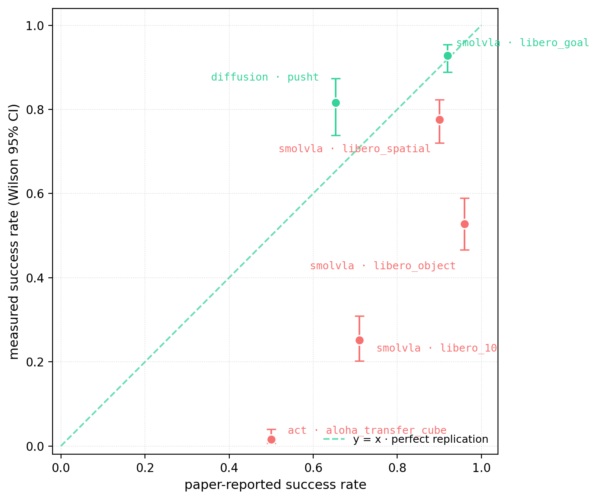

<div align="center">


### A public, reproducible benchmark of pretrained LeRobot manipulation policies.

5 policies in v1 (plus xvla executed-but-deferred) × 6 sim envs · multi-seed contract · Wilson + bootstrap CIs · MDE bounds · paired comparisons · failure taxonomy.

[](https://www.python.org/downloads/release/python-3120/)
[](LICENSE)
[](https://github.com/astral-sh/ruff)
[](https://github.com/thrmnn/lerobot-bench/actions/workflows/ci.yml)


**Quick links:** [Get started](docs/GETTING_STARTED.md) · [Paper (LaTeX source)](paper/main.tex) · [Bring your own env](docs/ENV_CONTRIBUTION_GUIDE.md) · [Contributing](CONTRIBUTING.md) · [Reproduce](docs/REPRODUCE.md)
<picture>
  
</picture>

</div>

---

> Public multi-policy benchmark for pretrained LeRobot policies on PushT, Aloha, and LIBERO sim envs.
> Multi-seed contract, bootstrap + Wilson CIs, MDE bounds, paired comparisons, failure taxonomy. Arxiv-grade writeup and upstream-ready eval module.

**Status: v1 finalized (dataset version `v1.0.0`), with v1.0.1 methodology audit incorporated into framing.** Sweep complete: **22 cells (18 published) × 5 seeds = 110 cell-seed runs dispatched, 0 failures** across 6 policies × 6 envs (a cell is one (policy, env) pair). Two cells were auto-downscoped to **25 episodes/seed (N=125)** after calibration flagged slow inference: **`diffusion_policy × pusht`** (published) and **`xvla × libero_10`** (excluded from publish — its downscope was dispatch-time only). Pi0 family deferred to v1.1 (~30 GB host-RAM cold-load spike — see [paper Limitations](paper/main.tex)). `xvla_libero` was executed but is **deferred from the v1 leaderboard and excluded from the published parquet and videos** — two upstream Hub-artifact wiring bugs were patched in our loader but a third unresolved issue still produces 0% rollouts; see [`docs/DEFERRED_POLICIES.md`](docs/DEFERRED_POLICIES.md).

> **Headline finding — the v1.0.0 0.016 was a normalization bug we caught and fixed in our own harness.**
> ACT × `aloha_transfer_cube` = **0.824** [0.772, 0.866] (N=250, Hub-default inference, normalization fixed) — from `results.parquet`, our canonical leaderboard number. The v1.0.0 **0.016** was a **bench-side normalization bug on our end**: our eval harness silently skipped applying dataset normalization stats to `observation.images.top`, feeding ACT un-normalized image observations. We caught and fixed it in [PR #51](https://github.com/thrmnn/lerobot-bench/pull/51) (`_recover_dataset_stats_from_safetensors` disambiguates buffer names against config `feature_keys`). A controlled 2×2 ablation (normalization {buggy, fixed} × inference {Hub-default, paper-settings}, N=250/cell = 5 seeds × 50 ep) shows the recovery is **100% the normalization fix, 0% temporal ensembling**:
>
> | | Hub-default inference | paper-settings inference |
> |---|---|---|
> | **buggy** norm | 0.016 | 0.016 |
> | **fixed** norm | 0.812 | 0.768 |
>
> On broken norm, switching to paper inference settings does **nothing** (0.016 → 0.016). On fixed norm, Hub-default vs paper settings are **statistically indistinguishable** (0.812 vs 0.768, overlapping Wilson CIs) — **temporal ensembling is a wash, not the cause.** The ablation's fixed+Hub cell (0.812) and the leaderboard 0.824 are separate N=250 runs of the same condition, consistent within CI. Probe: [`scripts/probes/probe_act_normalization_ablation.py`](scripts/probes/probe_act_normalization_ablation.py) → [`results/probes/act-norm-ablation/`](results/probes/act-norm-ablation/) · fix: [PR #51](https://github.com/thrmnn/lerobot-bench/pull/51) · doc: [`docs/PROBE_RESULTS_V1.0.1.md`](docs/PROBE_RESULTS_V1.0.1.md).

> **Second finding — SmolVLA on `libero_10` is single-task scope, not 10-task average.**
> Measures **0.252** [0.202, 0.309] under the lerobot-bench v1 default protocol, against the **0.71** reported by Shukor et al. The v1.0.1 audit ([PR #84](https://github.com/thrmnn/lerobot-bench/pull/84) scope, [PR #89](https://github.com/thrmnn/lerobot-bench/pull/89) step cap) establishes this is a **single-task probe at a truncated step cap** (`task_id=0` × 5 seeds × 50 ep vs. the paper's 10 tasks × 10 trials/suite; 74.8% of failed episodes hit our 520-step cap vs. canonical 600). The 0.252 is real for that scope and is a **lower bound** at our cap; v1.1 closes both caveats via [PR #90](https://github.com/thrmnn/lerobot-bench/pull/90)'s selectable `--canonical` criterion + all-10-tasks LIBERO sweep. See [Methodology caveats](#methodology-caveats-v101-audit) below.

---

## TL;DR — what you get

Three artifacts, all open:

1. **Public leaderboard** — Hugging Face Space + Hub dataset `thrmnn/lerobot-bench-v1` (v1.0.0, 110 cell-seed runs, 0 failures; 18 published cells). Every per-episode outcome, every rollout MP4, queryable by `(policy, env, seed, episode)`.

2. **4-page arxiv writeup** — `paper/main.tex`. Methodology, related work, results, limitations. Every figure regenerated from `notebooks/01-write-finding.ipynb`.
3. **Upstream-ready eval pipeline** — `src/lerobot_bench/eval.py` extracted as `lerobot.eval.multi_seed` in a follow-up PR to `huggingface/lerobot`.

Two tools for running and inspecting it:

| | What | URL when local |
|---|---|---|
| 🟢 **`dashboard/`** | Local operator dashboard: live sweep progress, calibration inspector, rollout video preview, color-coded log tail | `make dashboard` → http://127.0.0.1:7860 |
| 🔵 **`space/`** | Public HF Space leaderboard, paired comparisons, failure taxonomy | `python space/app.py` |

---

## v1 scope

**5 leaderboard policies + xvla executed-but-deferred × 6 envs — 22 cells (18 published) × 5 seeds = 110 cell-seed runs dispatched after `env_compat` filter, 0 failures:**

| | pusht | aloha_transfer_cube | libero_spatial | libero_object | libero_goal | libero_10 |
|---|:-:|:-:|:-:|:-:|:-:|:-:|
| `no_op` | ✓ | ✓ | ✓ | ✓ | ✓ | ✓ |
| `random` | ✓ | ✓ | ✓ | ✓ | ✓ | ✓ |
| `diffusion_policy` | ✓ | | | | | |
| `act` | | ✓ | | | | |
| `smolvla_libero` | | | ✓ | ✓ | ✓ | ✓ |
| `xvla_libero` | | | 🅓 | 🅓 | 🅓 | 🅓 |

Legend: ✓ runnable cell in v1 leaderboard · 🅓 cell *executed* in the v1 sweep but **deferred from the leaderboard**; upstream Hub artifacts ship with wiring bugs (PR #71 + PR #74 patch two; a third manifestation remained unresolved in the v1 window). See [`docs/DEFERRED_POLICIES.md`](docs/DEFERRED_POLICIES.md).

**5 seeds × 50 episodes per cell** (N=250 binary outcomes per cell; two cells — `diffusion_policy × pusht` (published) and `xvla × libero_10` (excluded from publish, dispatch-time downscope only) — were auto-downscoped to **25 episodes/seed (N=125)** after calibration flagged slow inference). Pi0 family (`pi0_libero`, `pi0fast_libero`, `pi05_libero_finetuned_v044`) **deferred to v1.1** — they overflow the 32 GB WSL2 host budget during `from_pretrained` cold load (~30 GB CPU RAM peak under HF Transformers' default weight-conversion path). v1.1 paths: quantized weights or `accelerate device_map="auto"` streaming load. The `xvla_libero` deferral is documented alongside the pi-family in [`docs/DEFERRED_POLICIES.md`](docs/DEFERRED_POLICIES.md).

---

## Methodology caveats (v1.0.1 audit)

After v1.0 sweep completion we conducted a static methodology audit against each policy's source paper and each env's canonical protocol. Three mismatches were confirmed; all three **constrain what the headline cells mean** without invalidating the underlying measurements. Every v1 parquet row remains valid for the scope it was measured under — the audit reframes how cross-paper comparisons should be read.

| Audit | What we ran | What the paper / canonical protocol uses | Effect on the headline |
|---|---|---|---|
| [PR #84](https://github.com/thrmnn/lerobot-bench/pull/84) — SmolVLA task coverage | `task_id=0` × 5 seeds × 50 ep = 250 single-task episodes per LIBERO suite | 10 tasks × 10 trials per task = 100-ep suite averages (Shukor et al., Table 2) | The "0.71 → 0.252" gap on `libero_10` is **single-task vs. 10-task-averaged scope**, not an apples-to-apples replication gap. Holds as a single-task envelope claim only. |
| [PR #86](https://github.com/thrmnn/lerobot-bench/pull/86) — ACT × aloha 0.016 | v1.0.0 harness silently skipped normalization on `observation.images.top` (un-normalized image obs) | Dataset normalization stats applied to all observation features | **RESOLVED — bench-side normalization bug on our end, fixed in [PR #51](https://github.com/thrmnn/lerobot-bench/pull/51).** Canonical ACT × aloha = **0.824** [0.772, 0.866] (N=250, Hub-default, norm fixed). A 2×2 ablation (norm {buggy, fixed} × inference {Hub-default, paper}, N=250/cell) — buggy=0.016/0.016, fixed=0.812/0.768 — shows recovery is 100% the norm fix and **temporal ensembling is a wash** (fixed cells indistinguishable). The earlier "0.764 probe" ran at post-#51 code, so it already had the norm fix; it conflated that fix with the inference-setting change. Probe: [`scripts/probes/probe_act_normalization_ablation.py`](scripts/probes/probe_act_normalization_ablation.py), [`results/probes/act-norm-ablation/`](results/probes/act-norm-ablation/). See [`docs/PROBE_RESULTS_V1.0.1.md`](docs/PROBE_RESULTS_V1.0.1.md). |
| [PR #89](https://github.com/thrmnn/lerobot-bench/pull/89) — LIBERO step caps | `max_steps={spatial=280, object=280, goal=300, libero_10=520}` (lerobot defaults) | `max_steps=600` for all four suites (canonical LIBERO, Liu et al.) | 74.8% of failed `libero_10` episodes hit our cap → **all four LIBERO numbers are lower bounds at our caps**; `libero_10` is the most sensitive. |

[PR #90](https://github.com/thrmnn/lerobot-bench/pull/90) ships a selectable `--canonical` criterion on `scripts/run_one.py` and `scripts/run_sweep.py` that adopts the canonical step caps and the paper-canonical success rules for PushT and Aloha; v1.1 reruns the audit-affected cells under it. Full audit reports: [`docs/CLAIM_AUDIT_SMOLVLA.md`](docs/CLAIM_AUDIT_SMOLVLA.md), [`docs/INFERENCE_AUDIT.md`](docs/INFERENCE_AUDIT.md), [`docs/SUCCESS_CRITERION_AUDIT.md`](docs/SUCCESS_CRITERION_AUDIT.md), [`docs/CANONICAL_CRITERIA.md`](docs/CANONICAL_CRITERIA.md). Per-policy "paper vs. measured" notes are in [`docs/MODEL_CARDS.md`](docs/MODEL_CARDS.md).

---

## Methodology in 60 seconds

- **Seed contract.** Per-cell determinism via `(env_seed, action_seed, policy_seed)` triple derived from the cell's seed index. Re-running cell `(policy, env, seed=k)` reproduces the exact parquet rows.
- **Confidence intervals.** Wilson 95% on per-cell success rate; stratified bootstrap (10k resamples over seed × episode) for distributional summaries and paired deltas.
- **Minimum detectable effect (MDE).** Pre-computed per-cell from N=250 and the cell's empirical success rate. Headline findings cite deltas only where `|delta| > MDE` (see [`docs/MDE_TABLE.md`](docs/MDE_TABLE.md)).
- **Failure taxonomy.** Per-rollout categorical labeling against `docs/FAILURE_TAXONOMY.md`; labels live in `labels.json` alongside the MP4.
- **Auto-downscope.** Calibration (20 steps per cell) flags `mean_step_ms > 100` (slow) or `vram_peak_mb > 5500` (VRAM-pressured) and trims that cell's episode budget so the full sweep fits.
- **Safety.** All heavy workloads run under a kernel-enforced 18 GB cgroup memory cap via `scripts/run_capped.sh`. Pre-flight gate refuses launch when baseline RAM > 55% used to protect parallel tenants on the host.

Full design: [`docs/DESIGN.md`](docs/DESIGN.md). Architecture: [`docs/ARCHITECTURE.md`](docs/ARCHITECTURE.md). MDE math: [`docs/MDE_TABLE.md`](docs/MDE_TABLE.md).

---

## What's next (planned, not shipped)

These are **roadmap items, not v1 deliverables** — listed so you can see where the benchmark is heading. Full plan: [`docs/PIPELINE_ROADMAP.md`](docs/PIPELINE_ROADMAP.md).

- **Coverage breadth (v1.1+).** All-10-task LIBERO sweep to close the SmolVLA single-task scope caveat; re-enable `xvla_libero` on the leaderboard once the upstream Hub-artifact bug is resolved; pi-family via streaming/quantized load.
- **Bring your own env.** Adding a new sim env to the matrix is a documented contribution path — see [`docs/ENV_CONTRIBUTION_GUIDE.md`](docs/ENV_CONTRIBUTION_GUIDE.md) and the worked exemplar [`thrmnn/lerobot-env-so100-pickplace`](https://github.com/thrmnn/lerobot-env-so100-pickplace), a standalone SO-100 pick-and-place env wired to the bench's eval contract.
- **Sim-to-real bridge (v1.3).** Re-run a subset of the matrix on physical Koch v1.1 / SO-100 hardware; the statistics infrastructure carries over unchanged.
- **World-model / JEPA planner track (exploratory).** A separate, slow-lane research effort evaluates world-model planners *as policies* (`act(obs) -> action`) through the same eval contract. It runs in its own [research repo, `thrmnn/lerobot-wm-research`](https://github.com/thrmnn/lerobot-wm-research), with its own toolchain and does **not** touch the production leaderboard: the only write into the bench is a gated adapter PR, held off the leaderboard until a planner is explicitly promoted. The two-speed operating model is documented in [`docs/TWO_SPEED.md`](docs/TWO_SPEED.md); the research track itself in [`docs/WM_RESEARCH_TRACK.md`](docs/WM_RESEARCH_TRACK.md).

This separation is deliberate: the production benchmark ships and stays stable (fast lane) while world-model research moves on its own clock (slow lane). See [`docs/TWO_SPEED.md`](docs/TWO_SPEED.md).

---

## Getting started

From `git clone` to a real benchmark result in two commands. Run them from
an activated Python 3.12 conda env (`conda activate lerobot`):

```bash
# 1. Clone and install (editable, all extras: sim + viz + space + dev)
git clone https://github.com/thrmnn/lerobot-bench.git && cd lerobot-bench
pip install -e ".[all]"

# 2. Run a single (policy, env, seed) cell — a few minutes (model download + 5 rollouts)
python scripts/run_one.py --policy act --env aloha_transfer_cube --seed 0 --n-episodes 5
```

You just produced per-episode rows in `results/results.parquet` and rollout
MP4s in `results/videos/` — the same artifacts every leaderboard number is
built from.

**→ Full walkthrough, expected output, and common-issue fixes:
[`docs/GETTING_STARTED.md`](docs/GETTING_STARTED.md).**

### Run the full sweep

```bash
# 1. Calibrate (~30 min — measures step latency + VRAM per cell)
make calibrate

# 2. Merge per-policy calibration JSONs (if you split the run)
python scripts/merge_calibration.py results/calibration-cheap.json \
    results/calibration-smolvla.json results/calibration-xvla.json \
    --out results/calibration-$(date +%Y-%m-%d).json

# 3. Generate sweep_full.yaml overrides from calibration
python scripts/auto_downscope.py results/calibration-$(date +%Y-%m-%d).json --apply

# 4. Launch under the 18 GB cgroup cap (overnight, ~8-15 hr)
scripts/launch_overnight_sweep.sh
```

### Watch progress

```bash
# Live operator dashboard
make dashboard
# → http://127.0.0.1:7860

# Or tail the log directly
tail -F logs/sweep-$(cat /tmp/lerobot-bench-sweep-ts).log
```

---

## Repo layout

```
lerobot-bench/
├── src/lerobot_bench/     # eval, stats, render, registries, checkpointing
├── scripts/               # entrypoints: calibrate, run_sweep, run_one, publish_results,
│                          #             merge_calibration, auto_downscope,
│                          #             run_capped, watchdog, launch_overnight_sweep
├── configs/               # policies.yaml, envs.yaml, sweep_full.yaml, sweep_mini.yaml
├── dashboard/             # local-first operator Gradio app
├── space/                 # public HF Space app (Gradio)
├── notebooks/             # 01-write-finding.ipynb (every paper figure)
├── paper/                 # main.tex + references.bib (4-page arxiv writeup)
├── tests/                 # 570+ tests (lint + mypy + pytest, all green on CI)
├── docs/                  # DESIGN, ARCHITECTURE, MDE_TABLE, FAILURE_TAXONOMY, RUNBOOK
└── results/               # gitignored — pushed to HF Hub dataset on publish
```

---

## Development

```bash
make install      # editable install with dev extras
make lint         # ruff check
make format       # ruff format
make typecheck    # mypy
make test         # pytest fast tier
make all          # lint + typecheck + test
make dashboard    # launch the local operator dashboard
make sweep-full   # full sweep (no cap; for the capped overnight run use scripts/launch_overnight_sweep.sh)
```

Pre-commit hooks run ruff and the typecheck/test fast tier on every commit. CI on every push and PR.

---

## Reproducibility contract

Every leaderboard row is anchored to:
- The pinned `lerobot==0.5.1` PyPI release (recorded in `pyproject.toml`).
- A pinned commit SHA per policy checkpoint (`configs/policies.yaml`, validated by tests).
- A deterministic seeding contract documented in [`docs/DESIGN.md`](docs/DESIGN.md) § Methodology.
- Wilson + bootstrap CIs from `src/lerobot_bench/stats.py` (audited; see PR #30 commit).
- Cell-boundary checkpointing in `src/lerobot_bench/checkpointing.py` — `kill -9` during the sweep loses only the current cell.

Hardware reference: NVIDIA RTX 4060 Laptop (8 GB VRAM), 32 GB host RAM, Ubuntu on WSL2.

---

## License

MIT. See [LICENSE](LICENSE).

## Citation

The arxiv writeup pre-print lands alongside the v1.0.0 dataset upload. Until the arXiv ID is assigned, cite this repository using [`CITATION.cff`](CITATION.cff) (GitHub's "Cite this repository" widget reads it directly).
<!-- TODO: add the arxiv BibTeX entry here once the ID is assigned (dataset is live at huggingface.co/datasets/thrmnn/lerobot-bench-v1). -->
