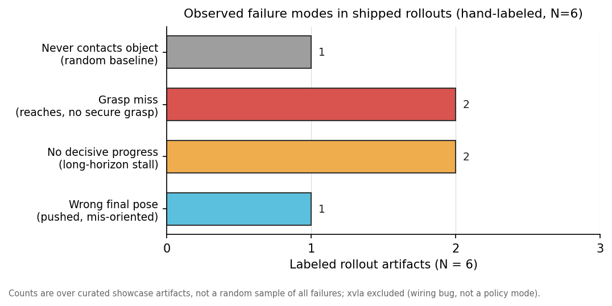

# Failure taxonomy — labeled from real rollouts

Status: **LABELED (small honest sample).** This is no longer a template.
The distribution below is hand-labeled from the rollout artifacts that
actually ship in this repo. The sample is small and *curated* (not a
random draw over all failures), and the doc says so loudly — see
[Method, sample size, and limitations](#method-sample-size-and-limitations).

Owner: researcher + the human (sanity-check pass owed, see end).
Figure: [`assets/fig-failure-taxonomy.svg`](assets/fig-failure-taxonomy.svg)
(generator: [`assets/make_failure_taxonomy_fig.py`](assets/make_failure_taxonomy_fig.py)).
Labels: [`assets/failure-taxonomy-labels.csv`](assets/failure-taxonomy-labels.csv).

## Why this exists

A leaderboard says *what* succeeds and *what* doesn't. A failure
taxonomy says *how* a policy fails when it fails — the diagnostic depth a
reviewer reads for. The honest version of that, given what is on disk
today, is a *small labeled set with disclosed provenance*, not a full
per-policy stacked bar over thousands of episodes. We label what the
evidence supports and we keep the claims proportional to it.

## What evidence exists (and what doesn't)

- **No per-episode failure data ships in this repo.** The only results
  parquet on disk (`examples/results-mini.parquet`) is **cell-aggregated**:
  one row per `(policy, env)` with `n_episodes`, `n_success`,
  `success_rate`, and a Wilson interval. It has **no per-episode rows,
  no `n_steps`, no `terminated`/`truncated` flags, and no `failure_label`
  column.** So labeling *by episode record* — the protocol the old
  template described — is **not possible from the shipped data**. The
  per-episode schema exists in `src/embodimetry/eval.py`
  (`EpisodeResult` / `CellResult.to_rows`), but no full-sweep
  per-episode parquet is committed.
- **The per-rollout evidence is the curated showcase media** under
  [`docs/assets/rollouts/`](assets/rollouts/): ten short MP4 loops and a
  handful of stills. These were selected to *illustrate* the writeup
  (most are `*-success`), so they are **not a random sample of failures.**
  Of them, the clearly-failed artifacts are: `act-aloha-fail.mp4` +
  `act-aloha-fail.png`, `smolvla-10-fail.mp4` + `smolvla-10-fail.png`,
  `random-aloha.mp4`, `random-pusht.png`, and `xvla-fail.png`.

Given that, the responsible move is to **hand-label that handful of
failed artifacts by visual inspection, disclose N and method exactly,
and let the leaderboard carry the quantitative load.** A stats reviewer
would (rightly) reject a per-policy stacked taxonomy inferred from six
clips; we do not claim one.

## The labeled sample

**N = 6** failed rollout artifacts (xvla's `xvla-fail.png` is logged but
**excluded** from the distribution — see below). Labels assigned by
visual inspection of the MP4 frame sequence (extracted at ~8 fps) and the
PNG stills. Each label is the **first-fit observed failure mode** in
chronological order.

| artifact | policy | env | observed mode | what the video/still shows |
|---|---|---|---|---|
| `loops/act-aloha-fail.mp4` | act | aloha_transfer_cube | **grasp miss** | right arm reaches the red cube but never secures a stable grasp; cube stays on the table; transfer never completes |
| `rollouts/act-aloha-fail.png` | act | aloha_transfer_cube | **grasp miss** | both grippers frame the red cube but it is unsecured on the table at the captured still |
| `loops/random-aloha.mp4` | random | aloha_transfer_cube | **never contacts object** | arms execute large erratic uncontrolled motions; the cube is never approached or contacted |
| `rollouts/random-pusht.png` | random | pusht | **wrong final pose** | T-block displaced but left mis-oriented vs. the green goal-T; no convergence to the goal pose |
| `loops/smolvla-10-fail.mp4` | smolvla_libero | libero_10 | **no decisive progress** | arm hovers/moves over the cluttered LIBERO-10 table; scene state essentially unchanged across the clip |
| `rollouts/smolvla-10-fail.png` | smolvla_libero | libero_10 | **no decisive progress** | gripper poised above the clutter but no object is manipulated in the still |
| `rollouts/xvla-fail.png` | xvla | libero_goal | **unmeasurable (excluded)** | arm retracted from objects; xvla's 0/10 is a Hub-artifact wiring bug, *not* a policy mode (see below) |

## Distribution

| observed mode | count (N=6) |
|---|---|
| Grasp miss (reaches, no secure grasp) | 2 |
| No decisive progress (long-horizon stall) | 2 |
| Never contacts object (random baseline) | 1 |
| Wrong final pose (pushed, mis-oriented) | 1 |

Read this as four *observed* modes, not as per-policy proportions: with
one-to-two artifacts per cell there is no defensible per-policy
breakdown, and the figure deliberately aggregates across policies rather
than implying a per-policy stacked bar.

### What the labeled sample does and does not support

- **Supports** (qualitatively, from direct inspection): act's
  aloha-transfer failure is a *grasp* failure (it reaches the object but
  does not secure it), not a navigation or wrong-object failure; the
  `random` baseline fails by *never contacting* (aloha) or *leaving the
  object mis-posed* (pusht), which is the expected null-policy signature;
  smolvla's worst cell (libero_10, leaderboard success 0.252) fails by
  *stalling on the long horizon* rather than by an obvious grasp slip.
- **Does NOT support**: any claim about the *rate* of a mode within a
  cell, any per-policy stacked distribution, or any cross-policy "policy
  X fails by overshoot, policy Y by drift" statement. The sample is too
  small and too curated for that. Those claims need the per-episode
  labeling pass below.

### xvla is excluded by design

`xvla-fail.png` is labeled `unmeasurable` and dropped from the
distribution. xvla scores **0/10 across all four LIBERO suites**, and
that 0% is attributed to an unresolved Hub-artifact / inference-pipeline
wiring bug (see [`docs/MODEL_CARDS.md`](MODEL_CARDS.md) § xvla and
[`docs/DEFERRED_POLICIES.md`](DEFERRED_POLICIES.md)), **not** to a
policy-level failure mode. Assigning overshoot/slip/drift labels to
rollouts from a mis-wired loader would be meaningless, so the cell is
left explicitly unmeasurable rather than back-filled.

## Method, sample size, and limitations

**Method.** Per-rollout visual inspection. For each MP4 we extracted
frames at ~8 fps and read the trajectory start→mid→end; for each PNG we
read the single still. The label is the first observed failure mode in
chronological order. There is **no automated episode-record join** —
the per-episode parquet needed for that is not in the repo.

**Sample size.** N = 6 labeled artifacts (7 including the excluded xvla
still). This is a *disclosed-small* set, not a powered sample.

**Limitations** (a reviewer should weigh all of these):

1. **Curated, not random.** The shipped rollouts were chosen to
   illustrate the writeup; the failures among them are not a random draw
   over each cell's failure set. The distribution above is therefore
   *descriptive of these artifacts*, not an estimate of any cell's true
   mode mix.
2. **Single labeler, no agreement statistic.** One labeler, no second
   pass, no Cohen's κ. Ambiguous cases (e.g. "no decisive progress" vs. a
   slow-but-progressing attempt) were resolved conservatively but not
   adjudicated.
3. **No per-episode ground truth.** Without `n_steps` /
   `terminated`/`truncated` per episode we cannot compute a **cap-hit
   rate** (the timeout proxy) or separate timeout from drift
   quantitatively. The mode names here are visual judgments.
4. **Tiny per-cell N.** One-to-two artifacts per `(policy, env)` cell —
   far below any threshold for per-policy proportions.
5. **Observed modes ≠ the six-mode scheme.** What the artifacts actually
   show (grasp miss, never-contacts, no-decisive-progress, wrong-final-pose)
   does not map cleanly onto the abstract six modes below; the canonical
   scheme over-specifies relative to the evidence. See the reconciliation
   table.

## How to upgrade this to a real per-policy taxonomy

This needs the per-episode pass, which is a **future task gated on data**,
not something inferable from current artifacts:

1. Run (or locate) a full sweep that writes a **per-episode parquet**
   (`CellResult.to_rows`, one row per episode with `n_steps`,
   `errored`, `video_sha256`).
2. Add a `failure_label` column (the Space's `compute_failure_counts`
   already consumes it and drops non-canonical labels).
3. Sample **≥5 failed episodes per `(policy, env)` cell, stratified
   across seeds** (1 per seed before 5 from one seed), label each from
   its per-episode MP4 joined on `(policy, env, seed, episode_index)`.
4. Add a **second labeler on highlighted cells** and report Cohen's κ.

Only after (1)–(4) does a per-policy stacked bar become defensible.

## Reconciliation: observed modes → canonical six-mode scheme

The six headings below are the **target** vocabulary (the Space's
`parse_failure_taxonomy_md` and `tests/test_space.py` key on them, and
the future per-episode CSV legend uses the snake labels). They are kept
as the canonical reference. The mapping from what we *actually observed*
to these labels is approximate and is stated here rather than silently
applied:

| observed mode (this sample) | nearest canonical label | caveat |
|---|---|---|
| grasp miss | `gripper_slip` | imperfect: the canonical "slip" assumes a *successful* grasp that is then lost; the observed act failures never secure the grasp at all. A dedicated `grasp_miss` mode is the honest fix in a future schema bump. |
| never contacts object | `drift` | the random baseline's degenerate motion is closest to "drift" (no meaningful progress), but it is really a *never-engaged* failure. |
| no decisive progress | `timeout` | long-horizon stall ending without completion; maps to timeout if the episode runs to the step cap, which we cannot verify without per-episode `n_steps`. |
| wrong final pose | `timeout` | T pushed but mis-oriented at cap; distinct from `trajectory_overshoot`, which requires entering then leaving the success region. |

`trajectory_overshoot`, `wrong_object`, and `premature_release` are **not
observed** in the labeled artifacts. We do not claim they are absent in
general — only that none of the six labeled artifacts exhibits them.

### 1. Trajectory overshoot

**Definition.** Agent moves past the target object or zone and either
fails to correct or corrects too late to satisfy the success threshold
within `max_steps`. Most often manifests as the end-effector swinging
through the target on a high-velocity motion. **Not observed in the
current labeled sample.**

### 2. Gripper slip

**Definition.** Agent grasps the target successfully but loses contact
mid-trajectory before the success condition is met. Distinct from
**premature release** in that the gripper is still commanded closed — the
slip is a physics outcome, not a control decision. (In this sample the
nearest observed failures are *grasp misses*, where the grasp is never
secured — a related but distinct mode noted in the reconciliation table.)

### 3. Timeout

**Definition.** Agent exhausts `env.max_steps` without ever satisfying
the success threshold. Includes both "still trying" and "stuck";
distinguish from **drift** by whether the agent is making non-zero
progress toward the goal. Verifying timeout quantitatively needs
per-episode `n_steps` (a cap-hit proxy), which is **not on disk** — so
the smolvla long-horizon stall and the mis-posed PushT block are mapped
here on visual grounds only.

### 4. Wrong object

**Definition.** Agent interacts with a non-target object — picks the
wrong cube, pushes the wrong shape, attends to a distractor. Relevant for
multi-object scenes (Aloha, LIBERO); not applicable to PushT. **Not
observed in the current labeled sample.**

### 5. Premature release

**Definition.** Agent opens the gripper or releases the held object
before the success zone is reached. Distinct from **gripper slip** in
that the gripper command itself transitions to "open" mid-trajectory —
a control failure, not a physics failure. **Not observed in the current
labeled sample.**

### 6. Drift

**Definition.** Agent action collapses to a stationary or oscillatory
mode that makes no progress: actions collapse to near-zero ("freeze"),
oscillate between two poses, or the end-effector wanders off entirely.
Distinguished from **timeout** by the *quality* of the final actions
(timeout = "trying but not getting there"; drift = "no longer trying").
The `random` baseline's erratic aloha motion is the closest observed
instance, though it is better described as *never engaging* the object.

## Cross-references

- Per-policy notes: [`docs/MODEL_CARDS.md`](MODEL_CARDS.md) § Known
  failure modes (xvla's unmeasurable status is documented there).
- Deferred xvla wiring bug: [`docs/DEFERRED_POLICIES.md`](DEFERRED_POLICIES.md).
- Space "Failures" tab parser: `space/_helpers.py`
  (`parse_failure_taxonomy_md`, `compute_failure_counts`).
- Per-episode schema (for the future labeling pass):
  `src/embodimetry/eval.py` (`EpisodeResult`, `CellResult.to_rows`).

---

### Sanity-check owed (human)

Re-watch the three failure MP4s and confirm the mode calls before any of
this is quoted as a result:

- `act-aloha-fail.mp4` → **grasp miss** (does the right gripper ever
  close on and lift the cube? we read "no").
- `random-aloha.mp4` → **never contacts** (confirm the cube is never
  touched).
- `smolvla-10-fail.mp4` → **no decisive progress** (confirm no object is
  manipulated to completion).

And confirm the two stills (`random-pusht.png` → wrong final pose;
`smolvla-10-fail.png` → no decisive progress) read the same to a human
eye. If any call flips, edit the CSV and re-run
`python docs/assets/make_failure_taxonomy_fig.py`.
